## Website Outcomes

### Welcome Page
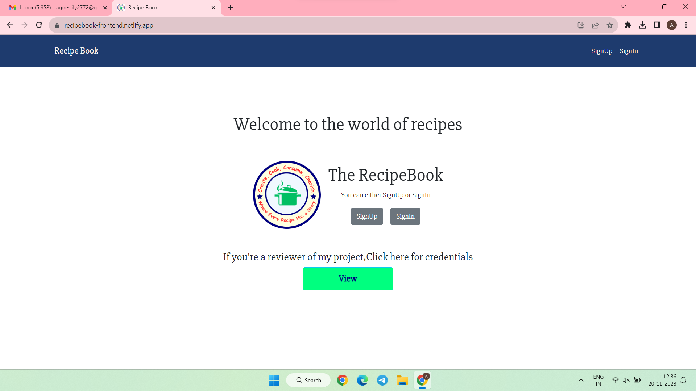

### Signup Page
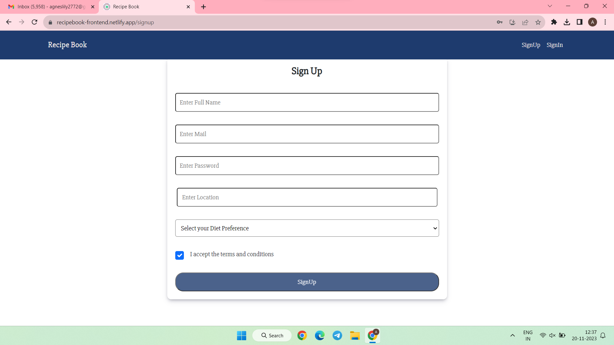

### Signin Page
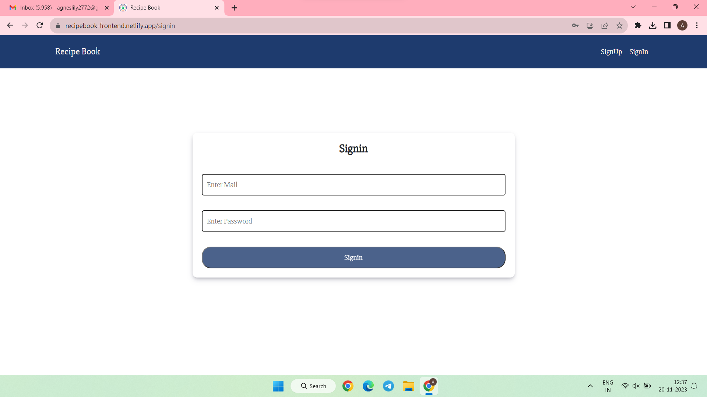

### Account Activation Page
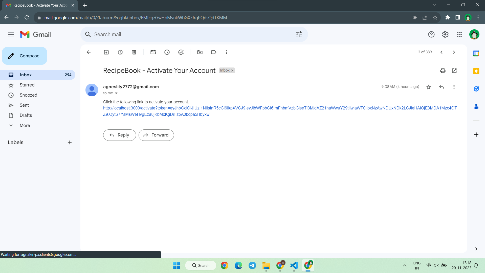

### Profile Page
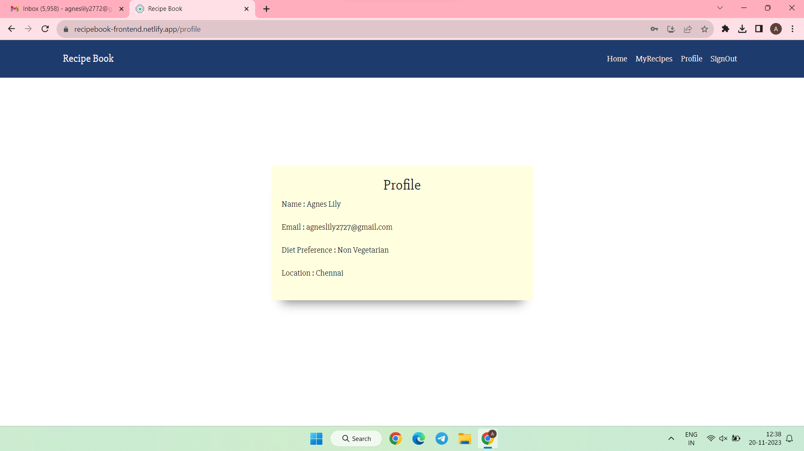

### All Recipes Page
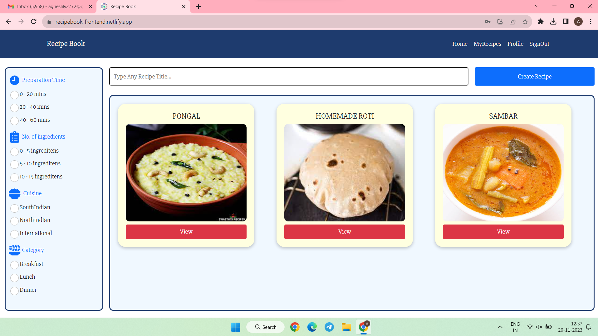

### Create Recipe Page
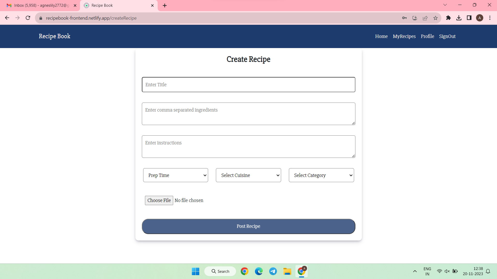

### Update Recipe Page
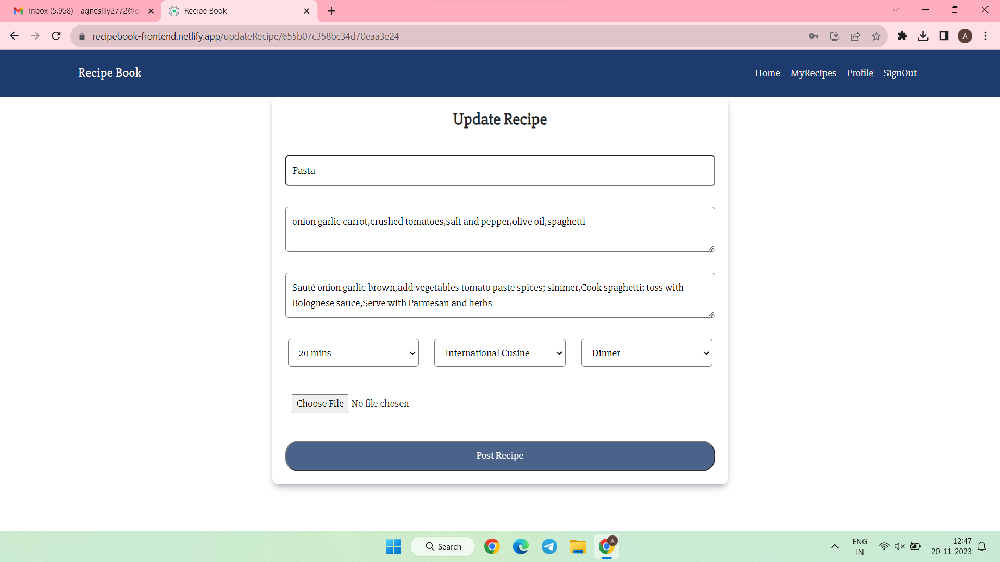

### My Recipes Page When There Is No Recipe
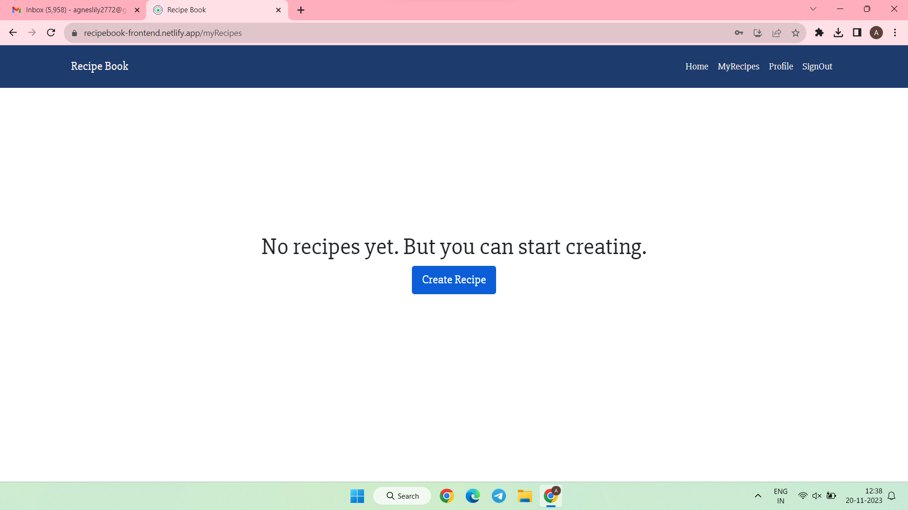

### My Recipes Page When There Are Recipes
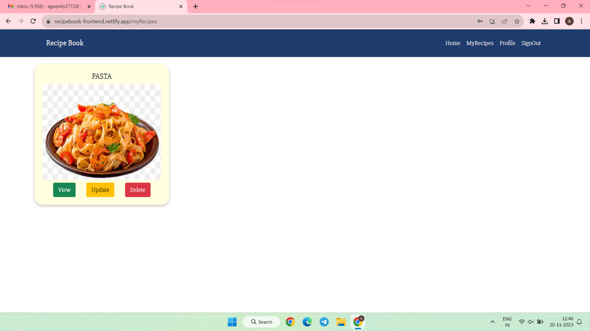

### Other Recipes Details View Page
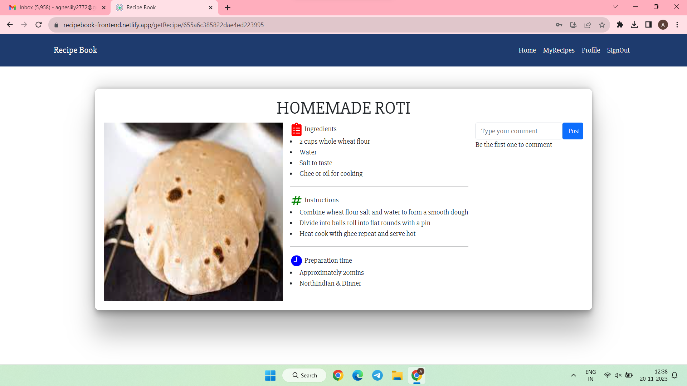

### My Recipes Details View Page
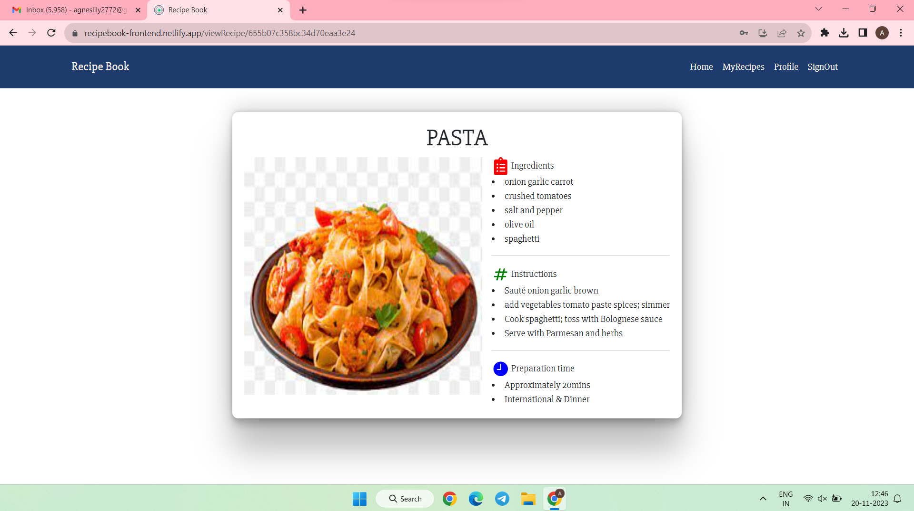

### Responsive View
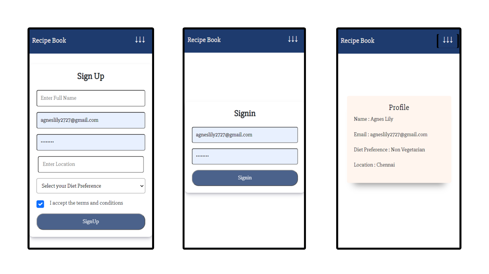 
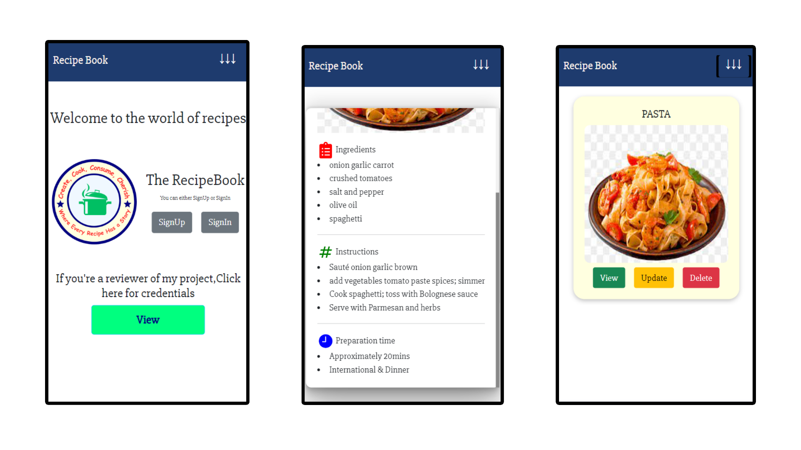
